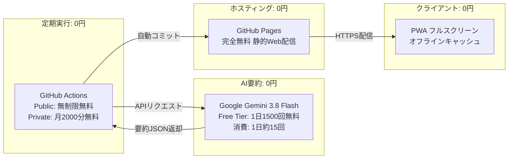
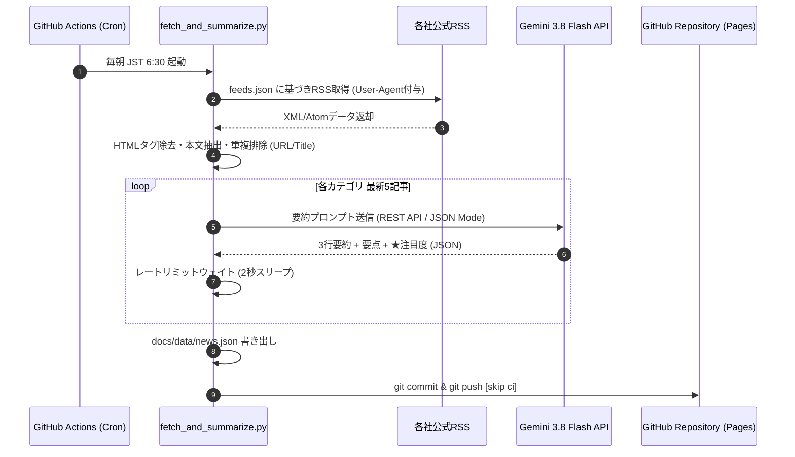

# ☀️ Morning Brief - システム設計書
（基本設計・詳細設計・仕様書・定数設計・構成管理）

---

## 1. 基本設計書 (Basic Design)

### 1.1 システム概要・目的
本システム（**Morning Brief**）は、多忙なビジネスパーソン・エンジニアが毎朝の通勤時間やスキマ時間（約30秒〜3分）に、主要かつ信頼性の高い最新ニュースをスマホでサクッと把握できるようにするための**完全自動・完全無料の個人向けPWAニュース要約配信システム**である。

### 1.2 対象カテゴリと収集方針
一次情報・公式発表に重きを置き、以下の3大重点分野を対象とする。

| カテゴリ | 対象領域 | 収集元ソースの選定理由 |
| :--- | :--- | :--- |
| **Azure** | クラウドインフラ、エンタープライズAI、セキュリティ、導入事例 | **Microsoft Official Blog**（公式発表・新機能）＋ Google News（主要報道） |
| **テスラ** | EV新車、FSD（完全自動運転）、Megapack/エネルギー事業、決算 | **Electrek**（世界最大のEV一次情報メディア）＋ Google News（速報） |
| **AI** | 基盤モデル、推論技術、マルチモーダル、生成AIビジネス動向 | **OpenAI Official** ＋ **Google AI Blog** ＋ Google News（最新技術動向） |

### 1.3 完全無料運用の実現方式（コスト設計: 永年0円）
商用クラウドの無料枠（Free Tier）を組み合わせることで、サーバー代・API代・ドメイン代を一切発生させない設計を採用している。



1. **GitHub Actions**: 
   - 毎朝 JST 6:30（UTC 21:30）にクラウドコンテナ（Ubuntu）が自動起動。
   - 処理時間は1回約1〜2分（月間約30〜60分）。Privateリポジトリでも無料枠（月2,000分）のわずか3%未満。
2. **Google Gemini API**:
   - `gemini-3.8-flash`（または指定モデル）を使用。
   - Free Tierは1日1,500リクエスト（15 RPM）。朝1回15記事の要約処理で消費するのはわずか15リクエスト（上限の1%）。クレカ登録不要。
3. **GitHub Pages**:
   - 静的HTML/CSS/JSおよび要約済みJSONをHTTPS経由で永年無料ホスティング。

### 1.4 クライアント設計 (iPhone PWA)
- **ネイティブアプリライクなUX**: Safariの「ホーム画面に追加」により、アドレスバーやナビゲーションバーを排除した全画面表示（`display: standalone`）。
- **オフライン耐性**: Service Workerによるローカルキャッシュ機構を備え、地下鉄などの電波圏外でも直近のニュースを即座に表示。

---

## 2. 詳細設計書 (Detailed Design)

### 2.1 データパイプライン詳細設計
データ収集・要約処理は `src/fetch_and_summarize.py` によって単一のパイプラインとして実行される。



#### 処理ステップ詳細
1. **フィード取得フェーズ**:
   - カスタムUser-Agentヘッダー（`Mozilla/5.0...`）を付与し、ボット遮断を回避。
   - `BeautifulSoup` によるHTMLエンティティ除去およびクリーンテキスト抽出（最大1,500文字）。
2. **重複排除・鮮度判定フェーズ**:
   - URL完全一致および空白正規化タイトルのハッシュにより同一記事を排除。
   - `published_parsed` をUTC基準でパースし、日本時間（JST: UTC+9）に変換。タイムスタンプ降順で各カテゴリ上位5件を抽出。
3. **AI要約生成フェーズ**:
   - プロンプトに厳格なJSONスキーマ（`headline`, `three_line_summary`, `key_points`, `category_badge`, `importance`）を指示。
   - レスポンス解析エラー時は、元タイトルと本文冒頭を代替するフォールバックロジックを搭載。

---

### 2.2 フロントエンド詳細設計

#### コンポーネント構成
- **Header**: 日付表示、最終更新時刻、利用モデルバッジ、ダークモードトグル、インフォモーダル起動
- **Category Nav**: 「すべて」「Azure」「テスラ」「AI」「保存」タブ（動的件数バッジ付き）
- **Control Bar**: 読了プログレスバー、「★4以上 注目」フィルター、「● 未読のみ」フィルター
- **Card List**:
  - `card-header`: カテゴリタグ、公式認証バッジ、★注目度バッジ（`★★★★★ ★5`）、未読/既読ステータスバッジ、配信日時
  - `card-headline`: 30文字以内の洗練された太字見出し
  - `summary-box`: 1/2/3のナンバリング付き3行要約
  - `details-content`: アコーディオン開閉式の重要ポイント箇条書き
  - `card-footer`: ソース元表示、☆保存ボタン、✓読了ボタン、元記事外部リンク

#### 状態管理とローカルストレージ設計
クライアント側の永続化はブラウザの `LocalStorage` を使用する。

| キー名 | 型 | 用途 |
| :--- | :--- | :--- |
| `briefnews_read` | `string` (JSON配列) | 読了済み記事のID一覧（例: `["azure_001", "ai_002"]`） |
| `briefnews_saved` | `string` (JSON配列) | お気に入り保存した記事のID一覧 |
| `briefnews_theme` | `string` (`"dark"` \| `"light"`) | 選択中のカラーテーマ（OS設定連動＋手動上書き） |

#### Service Worker（キャッシュ戦略）
- **戦略**: **Network-First with Cache Fallback**
  - オンライン時は常にネットワークから最新の `news.json` を取得してキャッシュを更新。
  - 通信エラー・オフライン時はService Workerが保持する静的アセットおよび直近の `news.json` を即座に返却。

---

## 3. 仕様書 (Specification)

### 3.1 非機能要件
- **レスポンシブ対応**: スマートフォン幅（320px〜430px）に完全最適化。iPhoneのノッチ・Dynamic Island・ホームバーの Safe Area（`env(safe-area-inset-*)`）に対応。
- **初回描画パフォーマンス**: 外部CSS/JSフレームワーク不使用（Vanilla JS + Pure CSS）。ページ総容量 50KB 未満、LCP 0.8秒以内。
- **耐障害性**: 
  - 特定のRSSフィードがダウンしても他フィードの取得を継続。
  - Gemini APIが一時的に停止した場合でも、モック要約にてサイト更新を完了。

### 3.2 データスキーマ仕様 (`docs/data/news.json`)

```json
{
  "$schema": "http://json-schema.org/draft-07/schema#",
  "title": "NewsDataSchema",
  "type": "object",
  "required": ["updated_at", "updated_at_iso", "model_used", "total_count", "categories"],
  "properties": {
    "updated_at": { "type": "string", "example": "2026年09月23日 07:00" },
    "updated_at_iso": { "type": "string", "format": "date-time" },
    "model_used": { "type": "string", "example": "gemini-3.8-flash" },
    "total_count": { "type": "integer", "example": 15 },
    "categories": {
      "type": "array",
      "items": {
        "type": "object",
        "required": ["id", "name", "icon", "description", "articles"],
        "properties": {
          "id": { "type": "string", "enum": ["azure", "tesla", "ai"] },
          "name": { "type": "string" },
          "icon": { "type": "string" },
          "description": { "type": "string" },
          "articles": {
            "type": "array",
            "items": {
              "type": "object",
              "required": [
                "id", "title", "link", "source", "is_official",
                "published_at", "headline", "summary", "key_points",
                "badge", "importance"
              ],
              "properties": {
                "id": { "type": "string" },
                "title": { "type": "string" },
                "link": { "type": "string", "format": "uri" },
                "source": { "type": "string" },
                "is_official": { "type": "boolean" },
                "published_at": { "type": "string" },
                "headline": { "type": "string" },
                "summary": {
                  "type": "array",
                  "items": { "type": "string" },
                  "minItems": 3,
                  "maxItems": 3
                },
                "key_points": {
                  "type": "array",
                  "items": { "type": "string" }
                },
                "badge": { "type": "string" },
                "importance": {
                  "type": "integer",
                  "minimum": 1,
                  "maximum": 5,
                  "description": "注目度スコア（1〜5の星数）"
                }
              }
            }
          }
        }
      }
    }
  }
}
```

---

## 4. 定数設計書 (Constants & Configuration)

### 4.1 環境変数一覧

| 変数名 | デフォルト値 | 必須 | 格納場所 | 説明 |
| :--- | :--- | :---: | :--- | :--- |
| `GEMINI_API_KEY` | なし | ○ | GitHub Secrets | Google AI Studio発行のAPIキー |
| `GEMINI_MODEL` | `gemini-3.8-flash` | - | GitHub Secrets / Env | 利用するGeminiモデル名（上位・最新モデル対応） |
| `MAX_ARTICLES_PER_CATEGORY` | `5` | - | Workflow env | 各カテゴリごとに要約する最大記事数 |

### 4.2 システム定数・設定値一覧

| 設定項目 | 設定値 | 設定ファイル | 備考 |
| :--- | :--- | :--- | :--- |
| **自動実行Cron** | `30 21 * * *` | `.github/workflows/update_news.yml` | UTC 21:30 = 日本時間（JST）毎朝 6:30 |
| **API待機時間** | `2.0 秒` | `src/fetch_and_summarize.py` | Gemini無料枠（15 RPM）超過防止スリープ |
| **HTTPタイムアウト** | `15 秒` (RSS) / `30 秒` (AI) | `src/fetch_and_summarize.py` | 外部通信ハング防止 |
| **本文抜粋文字数** | `1,200 文字` | `src/fetch_and_summarize.py` | トークン消費節約と要約精度の最適値 |
| **PWAテーマカラー** | `#0f172a` (Dark) / `#0284c7` (Light) | `docs/manifest.json` | ステータスバー表示色 |
| **キャッシュストレージ名** | `morning-brief-v1` | `docs/sw.js` | Service Workerキャッシュ識別名 |

### 4.3 注目度スコア（★1〜★5）定義表

| スコア | 表示 | 判定基準 | プロンプト定義 |
| :---: | :---: | :--- | :--- |
| **★5** | `★★★★★` | **業界激震・歴史的発表** | 大型新モデルリリース、重大セキュリティ修正、経営・法規制の特大ニュース |
| **★4** | `★★★★☆` | **公式主要アップデート** | 公式ブログによる新機能発表、新型車両/FSD進化、四半期決算速報 |
| **★3** | `★★★☆☆` | **通常の重要ニュース** | 業界動向、主要メディアによる分析報道、企業導入事例 |
| **★2** | `★★☆☆☆` | **小規模更新・周辺情報** | マイナーパッチ、地域限定サービス、イベント予告 |
| **★1** | `★☆☆☆☆` | **補足・コラム** | 一般コラム、噂レベルの観測情報 |

---

## 5. 構成管理・運用保守設計 (Configuration Management & Ops)

### 5.1 ディレクトリ構成

```text
ニュースアプリ/
├── .github/
│   └── workflows/
│       └── update_news.yml        # CI/CD: 毎朝定時実行＆Pagesデプロイ定義
├── src/
│   ├── fetch_and_summarize.py     # Batch: ニュース収集＆AI要約メインエンジン
│   ├── feeds.json                 # Config: 収集元RSS定義ファイル
│   └── requirements.txt           # Config: Python依存パッケージリスト
├── docs/                          # Web: GitHub Pages公開ルート（PWA配信）
│   ├── index.html                 # View: メインUI（HTML5, セマンティックタグ）
│   ├── style.css                  # Style: レスポンシブ＆ダークモードCSS
│   ├── app.js                     # Logic: UI操作・状態管理・ローカル保存
│   ├── manifest.json              # PWA: Web App Manifest
│   ├── sw.js                      # PWA: オフラインService Worker
│   ├── DESIGN_DOC.md              # Doc: システム設計書（本ドキュメント）
│   ├── icons/
│   │   └── icon.svg               # Asset: 高解像度アプリアイコン
│   └── data/
│       └── news.json              # Data: 自動生成された要約ニュースデータ
├── .env.example                   # Config: ローカル検証用環境変数サンプル
└── README.md                      # Doc: ユーザー向けセットアップ・運用マニュアル
```

### 5.2 GitHubリポジトリ権限・ブランチ運用
- **ブランチ戦略**: シンプルなトランクベース運用（`main` ブランチ単一）。
- **デプロイフロー**: GitHub Actionsが最新データを生成後、`[skip ci]` を付与して `docs/data/news.json` を直接 `main` ブランチへコミット＆プッシュ。
- **必須アクセス権限**:
  - `Settings` → `Actions` → `General` → `Workflow permissions` を **「Read and write permissions」** に設定。

### 5.3 運用保守・トラブルシューティング

#### ① APIキーのローテーション
- キー有効期限切れや変更時は、GitHubの `Settings` → `Secrets and variables` → `Actions` にある `GEMINI_API_KEY` の値を更新するだけで完了（コード変更不要）。

#### ② ニュースソース（RSS）の追加・変更
- `src/feeds.json` の `feeds` 配列にURLを追加するだけで、次回実行時より自動的に巡回対象となる。

#### ③ 手動リカバリ実行
- 何らかの原因で定時実行がスキップされた場合や即時更新したい場合は、GitHubの **「Actions」** タブ → **「Update Daily News Summary」** → **「Run workflow」** をクリックすることでオンデマンド実行が可能。
